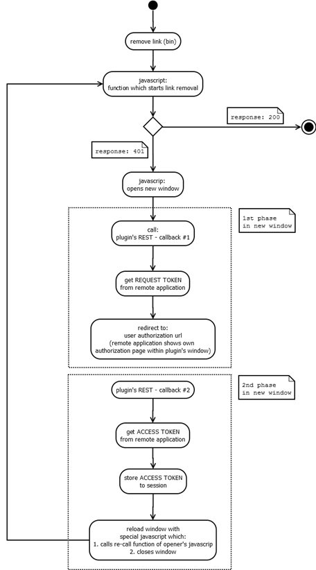

Technical documentation
=======================
## Introduction
OSLC adapter described in this document is designed to bring Jira users possibility to link issues
with (equivalent) objects in similar products further called external systems.

 

Adapter is created as plugin for Jira product. It is released as single jar file, which can be installed
to Jira without any further dependencies. All dependencies are either provided by Jira or packed into
resulting jar file.

Linking between objects is realized via standard HTTP protocol, using standard HTTP operations (GET, POST, PUT).
Data exchanged through HTTP communication are formatted according to OSLC specification into RDF+XML or JSON format.

Adapter plugin acts both as provider and client. Regarding provider part, plugin provides necessary information
about Jira issues to external system.Regarding client part, plugin is only able to link with object from
external system. 

Formatting according to OSLC specification is done via Eclipse Lyo library.
To fulfil security requirements plugin support OAuth authentication mechanism. For external systems, plugin
acts as OAuth provider. In case of linking from Jira to external system, plugin acts as OAuth client.

## Technology
Adapter plugin is written using following listed technologies:
 *	Java (server side application logic)
 *	HTML, JavaScript, Apache Velocity (web pages and client side application logic)

For easier development of Jira plugins, Atlassian provides SDK for plugin development. SDK uses Maven (Apache)
product to form projects and set of special commands (batch script files) for managing plugin
project (e.g. adding components, building, etc.).

Plugin is possible to develop using Eclipse IDE. Atlassian SDK provides special command to convert maven project
to eclipse project.

Install the SDk from: https://developer.atlassian.com/docs/getting-started/set-up-the-atlassian-plugin-sdk-and-build-a-project.

## Building plugin
To build plugin from source you will need to have the Atlassian SDK installed and added to your path. Then:
 1. Get plugin project
 2. Locate pom.xml file and from that location execute atlas-package command
 3. After successful build, locate new folder "target" created in plugin project folder
 4. Locate resulting jar file with plugin
 
Note: Atlassian plugin SDK doesn't install all dependencies, even if they are provided. Instead all dependencies
defined in pom.xml will be downloaded during first build attempt. For this reason, developer station with internet
connection is strongly recommended.

## Plugin overview
Adapter plugin is maven project. Thus there is pom.xml file with plugin project definition.
Pom.xml file contains basic information about plugin (id, name, version, etc.) and
dependencies - list of libraries used by plugin. 

Dependencies are split to following categories (scope):
 1.	Provided - these libraries are part of Jira instance and it is not needed to manage them in any way
 2.	Test - libraries for testing part of plugin (which is packed to separate jar file)
 3.	Without scope - these libraries must be provided by plugin itself, maven build process ensures, that 
 they are packed into resulting jar

Adapter plugin consists of several components. Most of components are used for external interaction.
There are several servlets and REST resources. Servlets are designed to provide web pages for user interaction.
Plugin also implements one custom field to display external links.

Individual components are defined in atlassian-plugin.xml file, so called plugin descriptor. If component is
defined in this xml, it is ensured, that component is propagated and available. E.g. each servlet must be defined
here to be accessible by URL.

Atlassian-plugin.xml of our adapter plugin contains:
 -	Several servlets (accessible by url-pattern element) 
 -	REST component to access REST services (accessible by path element)
 -	Two servlet filters for handling authorization
 -	Custom field to display external links
 -	Several web items and sections to provide menu items (e.g. links to plugin administration pages)
 -	Active Object module (data persistence)
 -	Special component to access Active Objects engine
 -	Several Jira components import (Jira functionality used by plugin)

Note: more information about components can be found in following chapter about packages. 

 
### Packages
#### com.ericsson.jira.oslc.servlet
This package contains implementation of all servlets provided by plugin and other supporting classes.

#### com.ericsson.jira.oslc.services
This package contains all REST services, either for the OSLC provider or for internal plugin use.
Most of data provided by plugin services are formatted using classes or annotations from Lyo package.

#### com.ericsson.jira.oslc.resources
In this package, the classes are for representation of data provided outside via REST,
mainly in OSLC format. Package also contains several data classes for internal usage: either temporary or persistent.

Persistency of data is achieved by Active Objects engine, which is part of Jira. Engine uses plugin classes to save/read data
to/from Jira own database. All classes related to persistency are located in sub-package com.ericsson.jira.oslc.resources.ao.

#### com.ericsson.jira.oslc.oslcclient
Package contains only one class - Client. This class manages all HTTP requests to external system:
 -	getting consumer key from external system
 -	getting root services content
 -	getting service provider catalog
 -	getting service providers and types
 -	getting information about creation/selection dialog (delegation UI)
 -	adding link to object in external system
 -	removing link from object in external system
 -	OAuth - getting request token
 -	OAuth - getting access token

#### com.ericsson.jira.oslc.customfields
This package contains single class OslcLink, which represents "External Links" custom field. Field
is responsible to display external links in issue page and provides possibilities to add or remove external link.
Similarly to servlets, custom field also uses velocity template for rendering its content. Biggest part of custom
field definition is located in plugin descriptor (atlassian-plugin.xml), where velocity templates for view and edit
are defined. Class OslcLink itself only handles forwarding data to velocity template, rendering is done by Jira.

External links custom field is designed to be read-only, so that only way, how user can change its content, is via
provided actions (add, remove). This logic is implemented in JavaScript within view-oslclinks.vm velocity template.

Note: despite of custom field is made read-only, it has edit velocity template. The reason behind this is to prevent
losing custom field data, when issue is edited (via "Edit" button). Edit velocity template just holds actual custom fields data,
which are the copied back to custom field after edit is finished.

#### com.ericsson.jira.oslc.handlers
Package contains single class - OAuthHandler. This class acts as consumer store, consumers can be added, removed and fetched.
Class is used as helper in OAuth authentication process (e.g. by OAuthServices).

#### com.ericsson.jira.oslc.provider
This package contains several helper classes, providers, which are used by Lyo library to map data
classes (from resources package) to resulting format (RDF XML or JSON) and vice versa. For each format there is one
provider class with special behaviour. 

#### com.ericsson.jira.oslc
This is package for common, helper classes used by others.

### Classes
#### ServiceProviderCatalogSingleton
Class creates and provides "Service providers catalog" according to OSLC specification. Eclipse Lyo is used to form data - class ServiceProviderCatalog. Construction consists in creating service provider for each project existing in Jira instance. Each service provider is put to Lyo catalog class and this class is then provided outside.
#### JiraServiceProviderFactory
This is support class, which constructs service provider for given project using Lyo factory. Class adds definition if create and select dialog. Generated service provider is stored in ServiceProviderCatalogSingleton.
#### CredentialsFilter

This class is servlet filter and it is used for handling authentication of selected requests from external systems.
#### JiraUserFilter

This class is servlet filter, which is used for handling authentication to services used internally by plugin (e.g. HTTP request from plugin's javascripts).
#### OAuthConsumerServlet

Servlet is responsible to create administration page for handling OAuth consumers: 
-	registration consumer by hand
-	approving/declining consumer requests from external systems
-	list already registered consumers with possibility to remove them

Servlet uses oAuthConsumers.vm velocity template to render its page.
#### RootServicesManagementServlet

Servlet is responsible for administration page for handling Root services: 
-	registration of root service using its URL and getting consumer key from external system
-	list of registered root services with possibility to remove them

Servlet uses admin_rootservices.vm velocity template to render its page.
#### ServiceProviderCatalogsManagementServlet

Servlet is responsible for administration page for handling Service provider catalogs:
-	registering new catalog
-	list of registered catalogs with possibility to remove them

Servlet uses admin_spcatalogs.vm velocity template to render its page.
Note: The reason behind this class is following: plugin must act as OSLC client to be able to make link to external system. In most cases it is enough to register root service, which is then used to get all necessary data. However root services are not according to OSLC specification, but according to Jazz specification. Service provider catalog management page was introduced for cases, when external system doesn't support root services.
#### ProjectRelationshipsServlet

Servlet is responsible for administration page for handling service providers from external system:
-	using registered root service or registered catalog to get list of providers
-	adding selected providers
-	list of added providers with possibility to remove them

Servlet uses admin_project_relationships.vm velocity template to render its page.
#### CreateIssueServlet

This servlet provides HTML page for OSLC delegation UI - creation dialog. Page contains dynamically constructed form, which allows user to enter needed data for new issue. Construction of form is done using FieldScreenRenderer (from Jira API), which is able to provide HTML for given issue (based on issue type, user permissions, etc.). Resulting HTML is passed to create_issue.vm velocity template, which renders the page. 
Servlet is responsible for creating issue, when form is submitted by user. If issue pass the validation and following creation process, servlet send OSLC response to external system. Response is sent using JavaScript in create_issue_response.vm velocity template.
#### SelectIssueServlet

This servlet provides HTML page for OSLC delegation UI - selection dialog. Page contains HTML with table, which contains list of issues for given project and issue type (e.g. Bug). Table is selectable and user can pick one of issue for list. Page is rendered using select_issue.vm velocity template.
Servlet is responsible for handling selection, when user submits the choice. If selected issue is confirmed, servlet sends OSLC response to external system. Response is sent using JavaScript in create_issue_response.vm velocity template (because the process is the same as in creation, the same file is used).
#### AddOslcLinkDialogServlet

Servlet provides dialog, which is displayed, when user wants to create/select object in external system - "Add external link" dialog. Dialog provides list of registered service providers (providers are registered in project relationships page) and after selection it provides lists of types for creation/selection object from external system.
Servlet then displays corresponding dialog page, which is provided by external system (delegation UI). After user is done by creating/selecting in delegation UI, servlet page handles OSLC response from external system and adds new external link to issue.
Content of page is stored in AddOslcLinkDialog.vm velocity template. Apart from HTML, file also contains JavaScript with most of application logic for linking to external system (calling REST services, displaying delegation UI, etc.). Java side of servlet just do the rendering and providing necessary data.

#### RootServicesService

This class provides root service XML format, based on Jazz root services specification. Root service has information about OAuth and URL to service provider catalog.
#### ServiceProviderCatalogService

Service provides service provider catalog in RDF+XML, JSON or XML format. Format is done by Lyo package via ServiceProviderCatalog class from Lyo package.
#### ServiceProviderService

Service provides service provider in RDF+XML, JSON or XML format based on incoming provider, which is actually Jira project id. Format is done using ServiceProvider class from Lyo package. As described in servlets, service provider for each project is managed by ServiceProviderCatalogSingleton.
#### IssueTypeService, IssuePriorityService, IssueStatusService, IssueResolutionService

These services provide identifiers and names of specific Jira issue fields (e.g. issue type) in XML (RDF) format for usage by external systems.
#### JiraChangeRequestService

This is core service for manipulation with Jira issues. Service provides Jira issue in RDF+XML, JSON or XML format (via HTTP GET), either in full form or in partial form, if it is specified by oslc.properties parameter. Service also allows issue creation (POST) and update (PUT). Update can be either full or partial, if it is specified by oslc.properties parameter.
Jira issue is represented by plugin's JiraChangeRequest class, which uses Lyo (OSLC) annotations.
Service also provides list of Jira issues for given project id. List is represented by array of JiraChangeRequest instances.
#### OAuthServices

This service provides service either for external or for internal usage. External usage is mainly related to OAuth authorization services: either as OAuth provider or for OAuth client usage. Internal services are used by plugin to handle requests from own servlet pages (calls from javascripts).
In case of OAuth provider, there are several services for:
-	Providing and managing OAuth tokens (request, access)
-	User authorization
In case of OAuth client, there are:
-	Internal service for invoking OAuth dance - requesting request token from external system, calling user authorization URL
-	External service for finishing OAuth dance - OAuth callback, which displays user authorization dialog and after confirmation requests access token
In case of other internal services, they are managing removal actions, which are invoked from administration pages (described in chapter about servlet package).

#### OSLCLinksServices

This is special service class used only internally. Services from this class are used mainly in linking process: either when creation link to external system or when removing link.
Services are invoked from custom field for external links (removing) and from "Add external link" dialog (getting provider types, adding link).

#### JiraManager

JiraManager is special helper class, which acts as link between plugin code and Jira API. It provides several functions for accessing and managing Jira data (projects, issues, users).
#### HTTP

HTTP is special class for HTTP communication, mainly used by Client class. HTTP class implements methods for standard HTTP actions as GET, POST, PUT (plugin uses only these three). Communication is realized using DefaultHttpClient class from org.apache.httpcomponents library. Functions are responsible to prepare request: fill proper headers (e.g. OAuth authorization header), write body, send request and return response (HttpResponse) for further processing.

### OAuth
Adapter plugin supports OAuth authorization:
 1.	as OAuth provider, so external system can be authorized by plugin using OAuth
 2.	as OAuth client, so it can request OAuth authorization in external system
 
In case of provider, OAuth is implemented in OAuthServices class. Services class uses Lyo package for
managing tokens: providing request or access token using TokenStrategy class.

From OAuth client point of view, plugin uses access token to form OAuth authorization header in HTTP requests.
Access token is stored in instance of OAuthAccessor (from net.oauth). Accessor is stored in browser session.

#### OAuth dance - client side
Before plugin can use access token to access protected resource in external system, access token must be
retrieved. The process is called OAuth dance. It is described in this chapter.

OAuth dance basically starts with HTTP error response 401 (Unauthorized). When this response comes back from
external system, plugin starts OAuth dance. First plugin tries to get request token. If it is successful, request
token is send back to external system for user authorization. At this moment, user interaction is needed and user
confirms or rejects the authorization. If user confirms, request token comes back and plugin tries to exchange it
for access token. If it is successful, access token is stored to OAuthAccessor instance and to session.
Previously failed request is then repeated and this time access token is used in authorization header.

Following example describes OAuth dance in case of removing external link:
 1. User clicks on bin to remove link (in page's JavaScript).
 2. JavaScript calls internal plugin REST service to remove link form external application
 (OSLCLinksServices#removeOslcLinkFromRemoteApp).
 3. JavaScript gets back response 401.
 4. JavaScripts opens new window and target URL calls internal plugin REST service to start OAUth dance
 (OAuthServices#authorizationcallbackDialog). As URL parameter, current function signature is passed to service.
 This "re-call" function will be used to repeat operation.
 5. From this part, everything happens in new opened browser window. Service calls external system
 for request token (Client# oAuthDancePhase1).
 6. Service requests token comes back.
 7. Service redirects new window to user authorization URL from external system, callback URL is provided as parameter.
 8. User authorization URL from external system displays authorization request, which user confirms.
 9. External system calls provided callback url (OAuthServices# oAuthAuthorizationCallback).
 10.	Service handles callback and requests access token (Client# oAuthDancePhase2).
 11.	Access token comes back and it is stored to session.
 12.	Service responses with new content for new window - JavaScript, which is invoked immediately. This script
 gets "re-call" function signature and calls it on window opener - original JavaScript. Then closes new window.
 13.	Original JavaScript repeats call to internal plugin REST.
 
  
 
 

